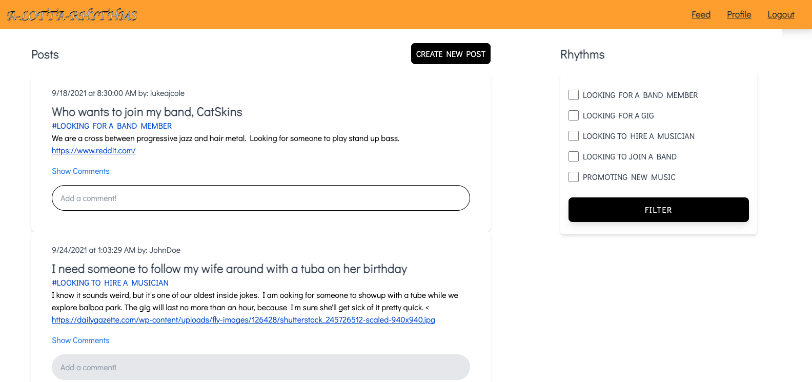

# A-LOTTA-RHYTHMS

## Objective:

A-LOTTA-RHYTHMS is an online social platform where music enthusiasts can connect with each other and create music together. 

## Experience:

Once a user signs up they will be able to choose their rhythm as we are calling it. Our rhythms consists of such things as looking for a band member,  wanting to learn an instrument, or looking for a place to play at. Users can view other users' posts(rhythms) and apply respond to the ones they are interested in. Users can also post their own rhythms for others to look at help with their music needs. 

## Motivation:

We decided to create a platform for those who live and breathe music in which they can easily connect with each other and feel comfortable with members of the community knowing this platform is specifically for music enthusiasts. 

## Technologies used:
JS,
HTML,
CSS,
mySQL

## Directions:

Being able to filter through users and be able to reach out to specific ones based on users' profile

Be able to pin specific posts and delete ones that do not sound appealing

Be able to notify respondents when a new post is made, or a comment is added to a rhythm they are interested in.

## Link:

Github repo: https://github.com/imoranmo/Project-2

Screenshots:

